# Fraud Detection Case Study for Private Client

### by:
- John Herr,
- Seth Hillis,
- Joe Tustin

## Table of Contents
1. [Scope of Project](#ScopeOfProject)
2. [Data](#Data)
3. [Model](#Model)
4. [Results](#Results)
5. [Code Review](#CodeReview)
6. [Big Finish](#LinktoFlaskApp)

## Scope of the Project: 
- Feature Engineering: Thurs am
  - Group Discussion
  - Data Cleaning: Seth
  - Doc2Vec: John
  - Markdown file: Joe
- Modeling: Thurs After
  - Group Discussion
  - Choice: RandomForest
  - Made use of: Bootstrapping, Bagging, and Ensemble
  - Ran Model on AWS
- Slight Intermission to Perfect Plan
  - Seth had to reinstall his Linux on his partitioned hard-drive
  - John had to pip uninstall and reinstall various python libraries
  - Joe had to fix github merge request issues and update pandas library to work with .pkl files
- Flask App: Fri Morning
  - Flask app up and running: Seth
  - Model Review and Final Featurized Dataset: John and Joe
  - Start of Documentation and Code Review: all
- Code Review and Presentation Prep: Fri aft

## Data:  What is it? and some sample EDA 
The Data is from Eventbrite and must be kept confidential.  The target for our modeling is simply whether the case was listed as a case of fraud or not.  It is listed in the column named "acct_type".  The feature columns for the data values are listed below.  Their data type varies from strings to ints to booleans.
In this dataset, there are 16,037 cases or rows of which 1,293 cases (roughly 8%) are fraud.  This dataset starts with 44 features which are listed below.  An important part of this problem was to balance the two classes using oversampling.

 ['acct_type', 'approx_payout_date', 'body_length', 'channels', 'country',
       'currency', 'delivery_method', 'description', 'email_domain',
       'event_created', 'event_end', 'event_published', 'event_start',
       'fb_published', 'gts', 'has_analytics', 'has_header', 'has_logo',
       'listed', 'name', 'name_length', 'num_order', 'num_payouts',
       'object_id', 'org_desc', 'org_facebook', 'org_name', 'org_twitter',
       'payee_name', 'payout_type', 'previous_payouts', 'sale_duration',
       'sale_duration2', 'show_map', 'ticket_types', 'user_age',
       'user_created', 'user_type', 'venue_address', 'venue_country',
       'venue_latitude', 'venue_longitude', 'venue_name', 'venue_state'],
      dtype='object')

After our EDA, the features that we really wanted to target in our model were:
1. `country`:  Country of Origin for Account
2. `description`:  Text string with lots of descriptive words which can be featurized using doc2vec.  Next, we cluster these vectors and assign the cluster number to a feature.
3. `time_differential` columns could be important.  We did this unpacking with `days till event`, `days to publish`, `event duration in days`. Would expect most events to happen within two month time period
4. `previous_payouts`:  If they have had previous payouts, they are probably a reputable organization.
5.  `venue_country`:  Does it match country of origin?
6.  `sale_duration`:  most events should happen within one to two months of the posting.
7.  Are there org_facebook and org_twitter numbers unique to fraudulent cases.
Seth checked this out and we did not observe any meaningful new information from the distribution plots so we left this feature out
8.  `name`:  Go through doc2vec, KMeans Clustering, and Cluster # assignment process  ie - "J. Anthony Brown & Friends Comedy Show"
9. `venue_name`:  Same process as above....
ie- "Blow The Whistle On Bullying ~ It Matters What...""
10. ticket types(list with dictionary): get cost and quantity_total.  Would get suspicious if a ticket cost $1 or $1000.  Would also be suspicious if the quantity total was 5 or 10,000.  

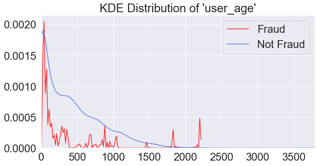
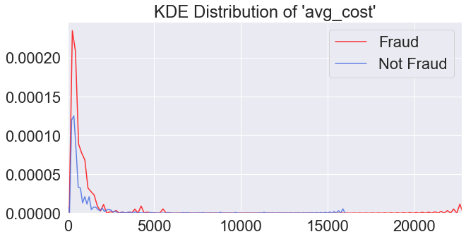
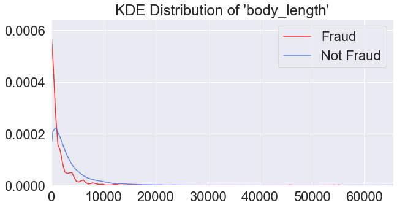
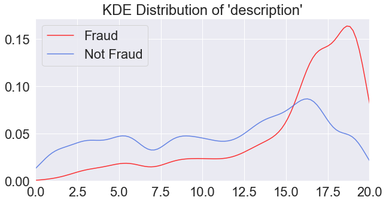
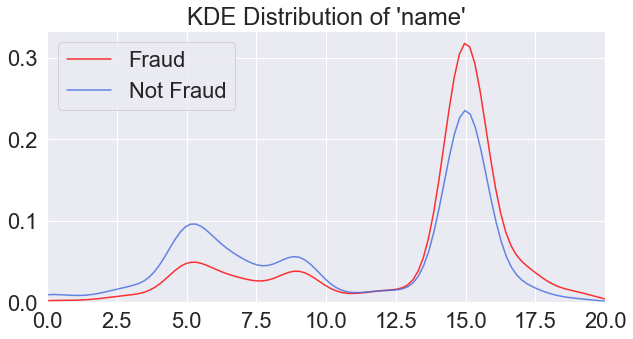

## Model: 
We chose to use a Random Forest Model, but were intrigued with the Gradient Boosted Models as well.

Gradient Boosted Machines are harder to tune than Random Forests. There are typically three parameters: number of trees, depth of trees and learning rate, and each tree built is generally shallow.

This being said, the ideas of bootstrapping and bagging in Random Forest is important. They can readily be incorporated into boosted tree training. This will indeed help the performance usually by reducing overfitting and acting as a cross validation of sorts.

Random Forests are much easier to tune than Gradient Boosted Machines. There are typically two parameters in RF: number of trees and number of features to be selected at each node.  You can also set the minimum number of nodes per leaf.

We ultimately chose random forest as we thought that it would give us more flexibility. It would be easier to not overfit, and hence, it would give us a lower test error. Plus, it is easier to train.

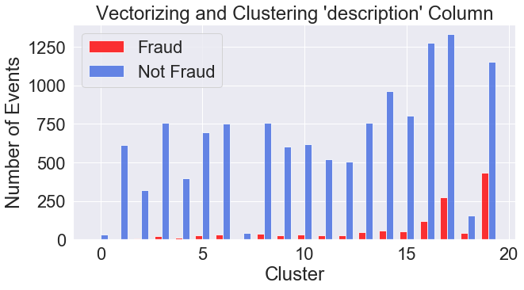
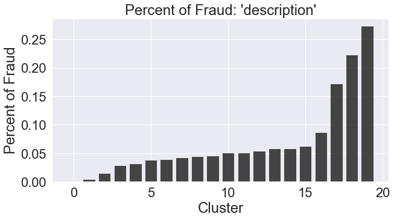
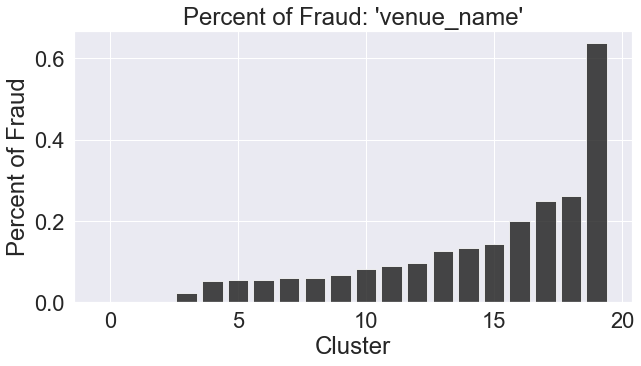
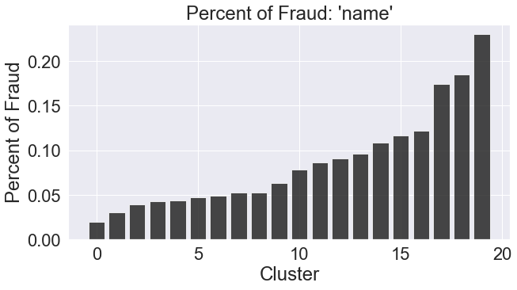

## Results: 

**Table 1**: Modeling Score Metrics For Random Forest Classifier
   
|label|precision|recall|f1-score|support|
|-----|---------|------|--------|-------|
| 0 | 1.00 | .98 | .99 | 2608 |
| 1 | .82 | .99 | .89 | 258 |

   accuracy                           0.98
   

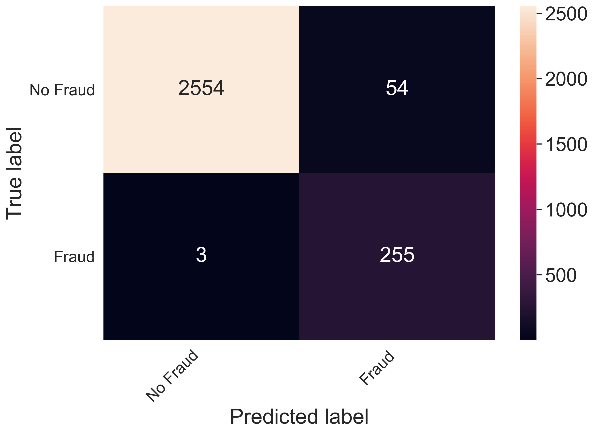

Scoring Results: Metrics
- Accuracy: Number of cases right( both positive and negative class)/total cases
- Precision(PPV): TP/(TP + FP)  "percentage of time that model predicts fraud correctly....more precision, less angry customers"
- Recall(TPR): TP / (TP + FN)  "lower recall, more lost money"
- F1: 2 * PPV * TPR / (PPV + TPR)  "averaging effect"

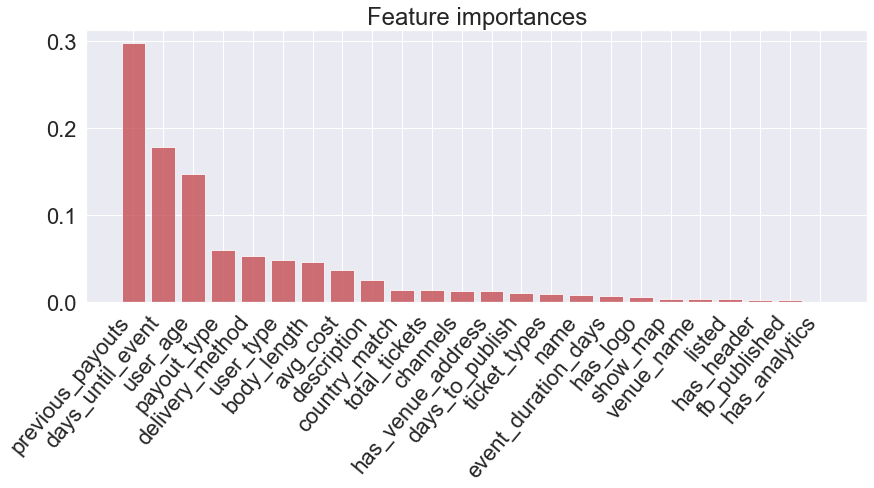

## Code Review: 
1. Code for Web App: [Link](https://github.com/johnherr/fraud_detection/blob/master/web_app/app.py)
2. Code for html file: [Link](https://github.com/johnherr/fraud_detection/blob/master/web_app/templates/home.html)

## Big Finish: 
Model and training data are stored on AWS EC2/S3 instance.  Flask app was developed to evaluate new data versus trained data.
Link to Flask App: [Our Flask App](http://my-project.me)
